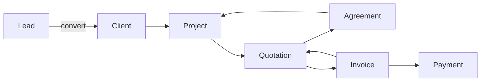
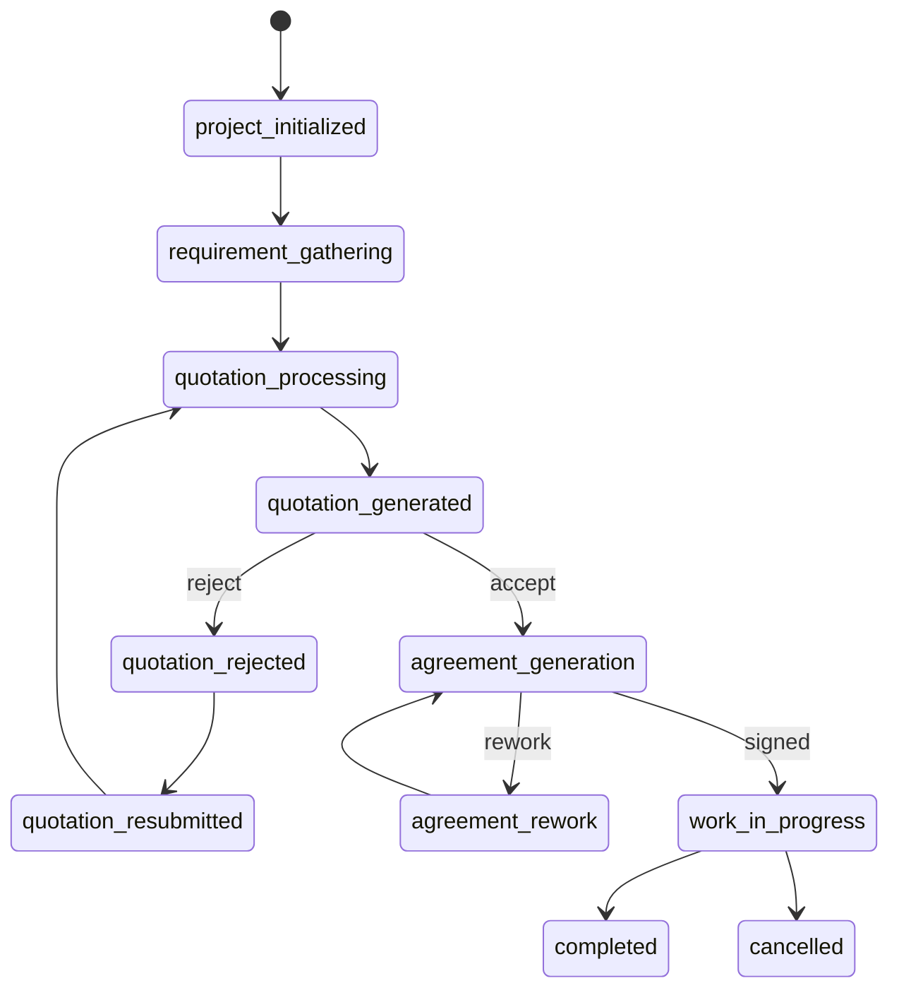
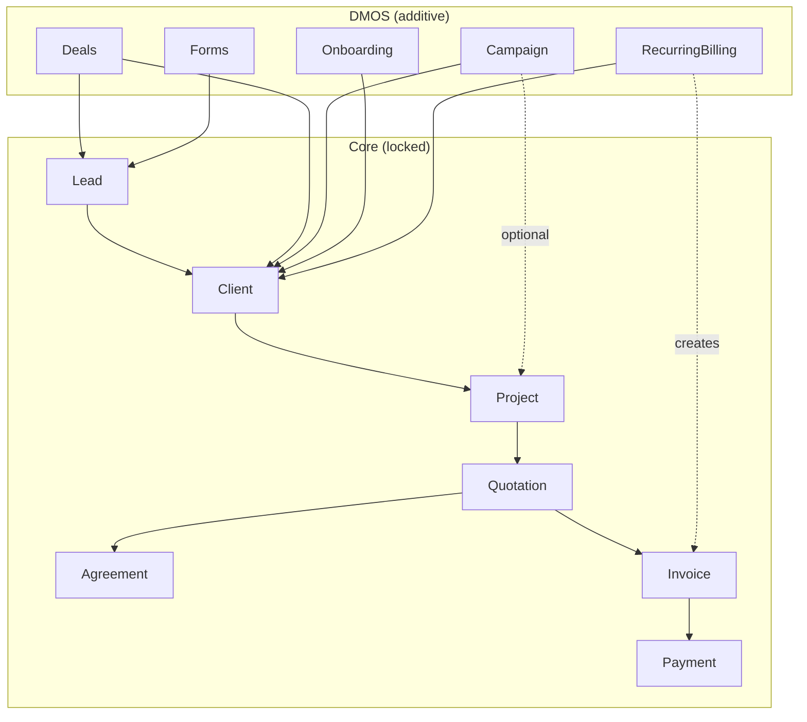

# V-Sparkz — Full Flow Documentation

This document is the **single reference** for all end-to-end flows in V-Sparkz: core CRM & billing (locked), DMOS attachment points, and how modules interact. The **locked** core is specified in [CORE-FLOW-CRM-BILLING.md](CORE-FLOW-CRM-BILLING.md); this file expands it with full flows, diagrams, and DMOS integration.

---

## Document Map

| Section | Content |
|--------|---------|
| 1 | Core flow summary (Lead → Invoice) |
| 2 | Step-by-step core flow with statuses and actions |
| 3 | Tenancy, auth, and feature flags |
| 4 | DMOS modules and where they attach |
| 5 | Key API routes and services |
| 6 | Frontend routes and sidebar |
| 7 | Extension rules (strict) |

---

## 1. Core Flow Summary (Locked)

The **inviolable** pipeline is:

```
Lead ──convert──> Client ──+──> Project ──> Quotation ──> Agreement ──> Invoice ──> Payment
                                │
                                └── (optional) Campaign links via campaign.project_id
```

- **Lead**: Inbound interest; has `tenant_id`, status, optional `converted_to_client_id`.
- **Client**: Created from Lead (or manually); owns Projects, Quotations, Agreements, Invoices.
- **Project**: Belongs to Client; has `workflow_status`; drives Quotation → Agreement → work → Invoice.
- **Quotation**: Built from Project/Client; pricing via `QuotationPricingService`; status draft/sent/accepted/rejected.
- **Agreement**: Tied to Quotation and Project; signed before work.
- **Invoice**: Tied to Quotation/Client; receives **Payment** records (Razorpay/Stripe); balance from payments and **InvoiceAdjustment**.

**Rule**: No new flow may replace or bypass this pipeline. New modules **attach** via foreign keys or polymorphic relations only.

---

## 2. Step-by-Step Core Flow

### 2.1 Lead capture and conversion

| Step | Actor | Action | System result |
|------|--------|--------|----------------|
| 1 | User / Form / API | Create or import **Lead** | `Lead` with `tenant_id`, status (e.g. new) |
| 2 | User | Nurture lead (status: contacted, follow_back, hold, rejected, closed) | `Lead` status and optional `LeadActivity` |
| 3 | User | **Convert lead to client** | New `Client`; `Lead.converted_to_client_id` set; one lead → one client |

**Models**: `Lead`, `LeadStatusHistory`, `LeadActivity`, `Client`.  
**API**: `POST /admin/leads/{lead}/convert-to-client`.

### 2.2 Project lifecycle

| Step | workflow_status | Action | System result |
|------|------------------|--------|----------------|
| 1 | `project_initialized` | Create **Project** for Client | `Project` with `client_id`, `tenant_id` |
| 2 | `requirement_gathering` | Add requirements / docs | `RequirementDocument`, `RequirementGathering` (if used) |
| 3 | `quotation_processing` | Build **Quotation** | `Quotation` (client_id, project_id), `QuotationService` line items; `QuotationPricingService` |
| 4 | `quotation_generated` | Send quotation to client | Quotation status → sent |
| 5 | (optional) `quotation_rejected` / `quotation_resubmitted` | Revise and resend | Updated quotation, status resubmitted |
| 6 | `agreement_generation` | Create **Agreement** from quotation | `Agreement` (client_id, project_id, quotation_id) |
| 7 | (optional) `agreement_rework` | Revise agreement | Updated agreement |
| 8 | — | Client signs | Agreement signed_at, file_path |
| 9 | `work_in_progress` | Assign team, log tasks/time | `ProjectTask`, `ProjectAssignment`, `TimeLog` |
| 10 | `completed` / `cancelled` | Close project | Project status updated |

**Models**: `Project`, `Quotation`, `QuotationService`, `Agreement`, `ProjectTask`, `ProjectAssignment`, `TimeLog`.  
**Services**: `QuotationPricingService` for pricing.

### 2.3 Invoicing and payment

| Step | Action | System result |
|------|--------|----------------|
| 1 | Create **Invoice** (from quotation or manual) | `Invoice` (client_id, quotation_id), items, total, due_date |
| 2 | Send invoice | Status → sent |
| 3 | Client pays (gateway or manual) | `Payment` (invoice_id, amount, gateway); webhooks update Invoice |
| 4 | Adjustments (credit/debit notes) | `InvoiceAdjustment`; balance = total − payments − credits + debits |

**Models**: `Invoice`, `Payment`, `InvoiceAdjustment`.  
**Contracts**: `PaymentGatewayInterface` (Razorpay, Stripe); `WebhookController` for gateway callbacks.

---

## 3. Tenancy, Auth, and Feature Flags

### 3.1 Tenant scope

- **Tenant**: One row in `tenants` (evolved from agencies). All business data is tenant-scoped.
- **Direct tenant_id**: Used on Lead, Client, Project, Campaign, and almost all DMOS tables. Models use `BelongsToTenant` and global scope.
- **Via client only**: Quotation, Agreement, Invoice, Payment have **no** global tenant scope. Controllers must scope by `client.tenant_id` (e.g. `whereHas('client', fn ($q) => $q->where('tenant_id', $tenantId))` or `Invoice::scopeForAgency()` using `client.tenant_id`).

### 3.2 Auth and middleware

- **Admin API**: `auth:sanctum`, `tenant`, `subscription` (and optionally `EnsureFeature` for DMOS modules).
- **Tenant resolution**: `IdentifyTenant` middleware (e.g. `X-Tenant` header, subdomain, or default).
- **Subscription / limits**: `CheckSubscriptionStatus`, `CheckPlanLimits`; plan and limits live on `Tenant` / `SubscriptionPlan`.

### 3.3 Feature flags

- **Source**: `Tenant.feature_flags` (e.g. JSON or key-value).
- **Usage**: Optional `EnsureFeature` (or custom check) so that when a flag is off (e.g. `dmos_deals`, `dmos_social_planner`), the corresponding API returns 403 or an empty list. UI can hide menu items for disabled features.

---

## 4. DMOS Modules and Where They Attach

All DMOS modules are **additive**. They attach to the core flow via FKs or polymorphic relations only.

| Module | Attachment point | Key tables / models | Rule |
|--------|------------------|---------------------|------|
| **Campaign (1)** | Client, optional Project | `campaigns`, `campaign_kpis`, `campaign_channels`, etc.; `campaign.project_id` nullable | Campaign is a container; may spawn or link to Project, never replace it. |
| **Deals (6)** | Lead, Client | `deals`, `deal_stages`, `deal_activities`, `forecast_snapshots`; `deal.lead_id`, `deal.client_id` | Reuse Lead/Client only; no parallel lead entity. |
| **Recurring Billing (13)** | Client, Invoice | `client_subscriptions`, `billing_cycles`, `transactions`; drives **creation** of Invoices via existing Invoice flow | Must not introduce a second invoicing path. |
| **Onboarding (16)** | Client | `onboarding_questionnaires`, `onboarding_responses`, `business_goals`, `competitor_intakes`, `onboarding_checklists`, `strategy_approvals` | All keyed by `client_id`. |
| **Attribution (17)** | Lead, Client, Campaign | `utm_events`, `funnel_events`, `channel_attribution_snapshots`; `lead_id`, `client_id`, `campaign_id` | Feeds from forms/landing; no change to Lead model. |
| **Forms / Lead capture (15)** | Lead, Client | `forms`, `form_submissions`, `form_widgets`, `tracking_sources`; submissions create or link to **Lead** / Client | Uses existing Lead; UTM for attribution. |
| **Collaboration (7)** | Polymorphic | `threads`, `messages`, `approvals`, `attachments`; `threadable_type/id`, `attachable_type/id` | Attach to Project, Campaign, Asset, Deal, etc. |
| **Assets (8)** | Client, Campaign | `assets`, `asset_collections`, `brand_guidelines`; `client_id`, `campaign_id` nullable | Used by Campaign and Social Planner. |
| **Reporting (10)** | Tenant, Client, Campaign, Project | `report_templates`, `report_instances`, `widgets`, `scheduled_exports`; context_type/context_id | Read-only aggregation over core + DMOS data. |
| **Profitability (9)** | Project, Campaign, TimeLog | `resource_costs`, `time_cost_mappings`, `profitability_snapshots` | Computed from existing TimeLog and Invoice/revenue. |

Other DMOS areas (SEO, Email automation, Ads, Social planner, Vendors, Compliance, Knowledge base, Productized services, Brands, Automation engine, Communication hub, White-label) also use `tenant_id` and link to Client/Campaign/Project where relevant; they do **not** replace any core entity.

---

## 5. Key API Routes and Services

### 5.1 Core (do not remove or break)

| Area | Methods | Route prefix | Controller / service |
|------|---------|--------------|----------------------|
| Leads | CRUD + convert | `/admin/leads` | LeadController; convert: `POST .../convert-to-client` |
| Clients | CRUD | `/admin/clients` | ClientController |
| Projects | CRUD | `/admin/projects` | ProjectController |
| Quotations | CRUD + build + PDF | `/admin/quotations` | QuotationController; QuotationPricingService |
| Agreements | CRUD + PDF | `/admin/agreements` | AgreementController |
| Invoices | CRUD + PDF | `/admin/invoices` | InvoiceController |
| Payments | create, confirm | `/admin/payments`, gateway endpoints | PaymentController, PaymentGatewayController |

### 5.2 DMOS (additive)

| Area | Route prefix | Controller / service |
|------|----------------------|----------------------|
| Deals | `/admin/deals` | DealController, DealService |
| Branding (read-only for theme) | `/admin/branding` | BrandingController, BrandingService |
| Keywords | `/admin/keywords` | KeywordController, SeoWorkspaceService |
| Contact lists | `/admin/contact-lists` | ContactListController, EmailAutomationService |
| Vendors | `/admin/vendors` | VendorController, VendorService |
| Brands | `/admin/brands` | BrandController, BrandManagementService |
| Workflow templates | `/admin/workflow-templates` | WorkflowTemplateController, WorkflowEngineService |
| Knowledge spaces | `/admin/knowledge-spaces` | KnowledgeSpaceController, KnowledgeBaseService |
| Onboarding questionnaires | `/admin/onboarding-questionnaires` | OnboardingQuestionnaireController, ClientOnboardingService |
| Automation workflows | `/admin/automation-workflows` | AutomationWorkflowController, AutomationEngineService |
| Report templates | `/admin/report-templates` | ReportTemplateController |
| Forms | `/admin/forms` | FormController, FormPlatformService |

All under `auth:sanctum`, `tenant`, `subscription`; tenant from `BaseController::getTenantId($request)` and scoping in controllers.

### 5.3 Configuration and integrations

- **System settings**: `GET/PUT /admin/system-settings`; `SettingsLoaderService` (tenant-aware, cached).
- **Integrations**: `IntegrationManager`; credentials in `integration_credentials`; adapters (e.g. Meta, LinkedIn, WhatsApp, Email) read config/credentials via manager, no hardcoded env in domain code.

---

## 6. Frontend Routes and Sidebar

- **Admin SPA** (React): Routes under `Layout` in `admin/src/App.jsx`; sidebar in `admin/src/components/Sidebar.jsx`; permissions in `admin/src/config/permissions.js`.
- **Core**: `/leads`, `/clients`, `/projects`, `/assign-project`, `/quotations`, `/agreements`, `/invoices`, `/reports`, etc.
- **DMOS**: `/deals`, `/social-planner`, `/ads`, `/seo-workspace`, `/email-automation`, `/workflows`, `/vendors`, `/knowledge-base`, `/service-packages`, `/brands`, `/compliance`, `/automation`, `/report-templates`.
- **Settings**: `/settings`, `/system-settings`, `/integrations`, `/plans`, etc.
- **Theming**: Admin (and optionally client portal) fetches `GET /admin/branding` on boot and applies CSS variables / data attributes (e.g. primary_color, logo_path) without removing existing Tailwind classes.

---

## 7. Extension Rules (Strict)

1. **No rewrites**: Do not change primary keys, unique constraints, or core behavior of Lead, Client, Project, Quotation, Agreement, Invoice, Payment, or their existing relationships.
2. **Additive only**: New tables link via foreign keys (e.g. `deal.client_id`, `campaign.project_id`) or polymorphic (e.g. `threads.threadable_type/id`). New columns on existing tables must be nullable or have safe defaults.
3. **Tenant scoping**: All new business tables have `tenant_id` and use `BelongsToTenant` unless purely global. Financial models stay scoped via `client.tenant_id` in controllers/scopes.
4. **Reuse pricing**: Productized services and new packaging extend `QuotationPricingService` or reuse ServicePrice / SubService / ComboPackage; no duplicate pricing logic.
5. **Preserve routes**: Existing API routes for leads, clients, projects, quotations, agreements, invoices, and payments remain; new modules get new routes and new sidebar entries.
6. **Recurring billing**: Only **drives** creation of Invoices through the existing Invoice model; no parallel invoicing path.
7. **Deals / attribution / forms**: Always use existing Lead and Client; do not introduce a parallel lead entity.

---

## 8. Flow Diagrams

### 8.1 Core pipeline (simplified)



### 8.2 Project workflow statuses (simplified)



### 8.3 Where DMOS attaches



---

## 9. Reference: Key Documents

| Document | Purpose |
|----------|---------|
| [CORE-FLOW-CRM-BILLING.md](CORE-FLOW-CRM-BILLING.md) | Locked specification: Lead → Client → Project → Quotation → Agreement → Invoice; tenancy; extension rules. |
| **FULL-FLOW-DOCUMENTATION.md** (this file) | End-to-end flows, statuses, DMOS attachment, API/service map, frontend, and diagrams. |

Use **CORE-FLOW-CRM-BILLING.md** as the contract for “what must not break.” Use this document for full flow understanding and onboarding.
